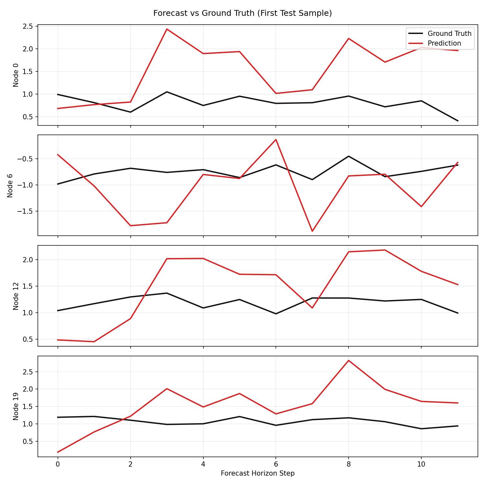
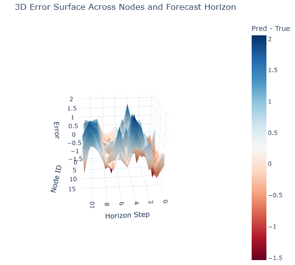

# ASTGCN Code Samples

This document contains key code samples from the ASTGCN (Attention-based Spatial-Temporal Graph Convolutional Network) implementation for traffic forecasting.

## Overview

ASTGCN is a deep learning model that combines spatial graph convolutions with temporal attention mechanisms to predict traffic flow. The model processes data at multiple temporal scales (recent, daily, weekly) and uses Chebyshev polynomials for graph convolutions.

## Key Functions

### Scaled Laplacian

The `scaled_laplacian` function computes the normalized Laplacian matrix from an adjacency matrix, which is essential for graph-based convolutions.

```python
def scaled_laplacian(adj: np.ndarray) -> np.ndarray:
    n = adj.shape[0]
    degree = np.diag(np.sum(adj, axis=1))
    lap = degree - adj
    d_inv_sqrt = np.diag(1.0 / np.sqrt(np.maximum(np.diag(degree), 1e-12)))
    lap_norm = d_inv_sqrt @ lap @ d_inv_sqrt
    lambda_max = np.linalg.eigvals(lap_norm).real.max()
    return (2.0 * lap_norm / lambda_max) - np.eye(n)
```

### Chebyshev Polynomials

The `cheb_polynomials` function generates Chebyshev polynomials of the scaled Laplacian, used in the graph convolution operations.

```python
def cheb_polynomials(l_tilde: np.ndarray, k_order: int) -> List[np.ndarray]:
    n = l_tilde.shape[0]
    cheb = [np.eye(n), l_tilde.copy()]
    if k_order == 1:
        return [cheb[0]]
    if k_order == 2:
        return cheb
    for _ in range(2, k_order):
        cheb.append(2 * l_tilde @ cheb[-1] - cheb[-2])
    return cheb
```

## Core Classes

### Spatial Attention

The `SpatialAttention` class implements spatial attention mechanism to focus on relevant spatial relationships between nodes.

```python
class SpatialAttention(nn.Module):
    def __init__(self, n_nodes: int, in_channels: int, n_timesteps: int):
        super().__init__()
        self.w1 = nn.Parameter(torch.empty(n_timesteps))
        self.w2 = nn.Parameter(torch.empty(in_channels, n_timesteps))
        self.w3 = nn.Parameter(torch.empty(in_channels))
        self.bs = nn.Parameter(torch.empty(1, n_nodes, n_nodes))
        self.vs = nn.Parameter(torch.empty(n_nodes, n_nodes))
        self.reset_parameters()

    def reset_parameters(self) -> None:
        for p in [self.w1, self.w2, self.w3, self.vs]:
            nn.init.xavier_uniform_(p.unsqueeze(0) if p.dim() == 1 else p)
        nn.init.zeros_(self.bs)

    def forward(self, x: torch.Tensor) -> torch.Tensor:
        # x: [B, N, F, T]
        lhs = torch.matmul(torch.matmul(x, self.w1), self.w2)  # [B, N, T]
        rhs = torch.matmul(self.w3, x).transpose(-1, -2)  # [B, T, N]
        product = torch.matmul(lhs, rhs)  # [B, N, N]
        s = torch.matmul(self.vs, torch.sigmoid(product + self.bs))
        return F.softmax(s, dim=-1)
```

### Temporal Attention

The `TemporalAttention` class implements temporal attention to capture dependencies across time steps.

```python
class TemporalAttention(nn.Module):
    def __init__(self, n_nodes: int, in_channels: int, n_timesteps: int):
        super().__init__()
        self.u1 = nn.Parameter(torch.empty(n_nodes))
        self.u2 = nn.Parameter(torch.empty(in_channels, n_nodes))
        self.u3 = nn.Parameter(torch.empty(in_channels))
        self.be = nn.Parameter(torch.empty(1, n_timesteps, n_timesteps))
        self.ve = nn.Parameter(torch.empty(n_timesteps, n_timesteps))
        self.reset_parameters()

    def reset_parameters(self) -> None:
        for p in [self.u1, self.u2, self.u3, self.ve]:
            nn.init.xavier_uniform_(p.unsqueeze(0) if p.dim() == 1 else p)
        nn.init.zeros_(self.be)

    def forward(self, x: torch.Tensor) -> torch.Tensor:
        # x: [B, N, F, T]
        lhs = torch.matmul(torch.matmul(x.permute(0, 3, 2, 1), self.u1), self.u2)  # [B, T, N]
        rhs = torch.matmul(self.u3, x)  # [B, N, T]
        product = torch.matmul(lhs, rhs)  # [B, T, T]
        e = torch.matmul(self.ve, torch.sigmoid(product + self.be))
        return F.softmax(e, dim=-1)
```

### Chebyshev Convolution with Spatial Attention

The `ChebConvWithSAtt` class performs graph convolution using Chebyshev polynomials, modulated by spatial attention.

```python
class ChebConvWithSAtt(nn.Module):
    def __init__(self, k_order: int, cheb_polys: List[np.ndarray], in_channels: int, out_channels: int):
        super().__init__()
        self.k_order = k_order
        self.register_buffer(
            "cheb_polys",
            torch.tensor(np.stack(cheb_polys[:k_order]), dtype=torch.float32),
        )
        self.theta = nn.Parameter(torch.empty(k_order, in_channels, out_channels))
        nn.init.xavier_uniform_(self.theta)

    def forward(self, x: torch.Tensor, s_att: torch.Tensor) -> torch.Tensor:
        # x: [B, N, F_in, T], s_att: [B, N, N]
        batch, n_nodes, _, n_steps = x.shape
        outputs = []
        for t in range(n_steps):
            x_t = x[:, :, :, t]  # [B, N, F_in]
            out_t = torch.zeros(batch, n_nodes, self.theta.shape[-1], device=x.device)
            for k in range(self.k_order):
                t_k = self.cheb_polys[k]  # [N, N]
                t_k_att = t_k.unsqueeze(0) * s_att  # [B, N, N]
                rhs = torch.bmm(t_k_att, x_t)  # [B, N, F_in]
                out_t = out_t + torch.matmul(rhs, self.theta[k])
            outputs.append(out_t.unsqueeze(-1))
        return F.relu(torch.cat(outputs, dim=-1))
```

### Spatial-Temporal Block

The `STBlock` class combines spatial and temporal attention with graph convolutions and temporal convolutions.

```python
class STBlock(nn.Module):
    def __init__(
        self,
        n_nodes: int,
        in_channels: int,
        k_order: int,
        cheb_polys: List[np.ndarray],
        n_chev_filters: int,
        n_time_filters: int,
        n_timesteps: int,
        time_kernel: int = 3,
    ):
        super().__init__()
        self.t_att = TemporalAttention(n_nodes, in_channels, n_timesteps)
        self.s_att = SpatialAttention(n_nodes, in_channels, n_timesteps)
        self.cheb_conv = ChebConvWithSAtt(k_order, cheb_polys, in_channels, n_chev_filters)
        self.time_conv = nn.Conv2d(
            in_channels=n_chev_filters,
            out_channels=n_time_filters,
            kernel_size=(1, time_kernel),
            padding=(0, time_kernel // 2),
        )
        self.residual_conv = nn.Conv2d(in_channels=in_channels, out_channels=n_time_filters, kernel_size=(1, 1))
        self.layer_norm = nn.LayerNorm(n_time_filters)

    def forward(self, x: torch.Tensor) -> torch.Tensor:
        # x: [B, N, F_in, T]
        t_att = self.t_att(x)
        x_tatt = torch.matmul(x.reshape(x.shape[0], -1, x.shape[-1]), t_att).reshape_as(x)
        s_att = self.s_att(x_tatt)
        x_gcn = self.cheb_conv(x_tatt, s_att)  # [B, N, F_g, T]
        x_time = self.time_conv(x_gcn.permute(0, 2, 1, 3))
        x_res = self.residual_conv(x.permute(0, 2, 1, 3))
        x_out = F.relu(x_time + x_res)
        # LayerNorm over channel dimension
        x_out = self.layer_norm(x_out.permute(0, 3, 2, 1)).permute(0, 2, 3, 1)
        return x_out
```

### ASTGCN Component

The `ASTGCNComponent` class stacks multiple STBlocks and includes a projection layer for prediction.

```python
class ASTGCNComponent(nn.Module):
    def __init__(
        self,
        n_blocks: int,
        n_nodes: int,
        in_channels: int,
        k_order: int,
        cheb_polys: List[np.ndarray],
        n_chev_filters: int,
        n_time_filters: int,
        n_timesteps: int,
        pred_len: int,
    ):
        super().__init__()
        blocks = [
            STBlock(
                n_nodes=n_nodes,
                in_channels=in_channels if i == 0 else n_time_filters,
                k_order=k_order,
                cheb_polys=cheb_polys,
                n_chev_filters=n_chev_filters,
                n_time_filters=n_time_filters,
                n_timesteps=n_timesteps,
            )
            for i in range(n_blocks)
        ]
        self.blocks = nn.ModuleList(blocks)
        self.proj = nn.Linear(n_time_filters * n_timesteps, pred_len)

    def forward(self, x: torch.Tensor) -> torch.Tensor:
        for blk in self.blocks:
            x = blk(x)
        b, n, c, t = x.shape
        return self.proj(x.reshape(b, n, c * t))
```

### Main ASTGCN Model

The `ASTGCN` class combines three components for different temporal scales (recent, daily, weekly) and fuses their outputs.

```python
class ASTGCN(nn.Module):
    def __init__(
        self,
        n_nodes: int,
        in_channels: int,
        pred_len: int,
        recent_len: int,
        daily_len: int,
        weekly_len: int,
        cheb_polys: List[np.ndarray],
        n_blocks: int = 2,
        k_order: int = 3,
        n_chev_filters: int = 64,
        n_time_filters: int = 64,
    ):
        super().__init__()
        self.recent = ASTGCNComponent(
            n_blocks,
            n_nodes,
            in_channels,
            k_order,
            cheb_polys,
            n_chev_filters,
            n_time_filters,
            recent_len,
            pred_len,
        )
        self.daily = ASTGCNComponent(
            n_blocks,
            n_nodes,
            in_channels,
            k_order,
            cheb_polys,
            n_chev_filters,
            n_time_filters,
            daily_len,
            pred_len,
        )
        self.weekly = ASTGCNComponent(
            n_blocks,
            n_nodes,
            in_channels,
            k_order,
            cheb_polys,
            n_chev_filters,
            n_time_filters,
            weekly_len,
            pred_len,
        )
        self.w_recent = nn.Parameter(torch.ones(1, n_nodes, pred_len))
        self.w_daily = nn.Parameter(torch.ones(1, n_nodes, pred_len))
        self.w_weekly = nn.Parameter(torch.ones(1, n_nodes, pred_len))

    def forward(self, x_recent: torch.Tensor, x_daily: torch.Tensor, x_weekly: torch.Tensor) -> torch.Tensor:
        y_recent = self.recent(x_recent)
        y_daily = self.daily(x_daily)
        y_weekly = self.weekly(x_weekly)
        return self.w_recent * y_recent + self.w_daily * y_daily + self.w_weekly * y_weekly
```

## Usage Example

To use the ASTGCN model, you would typically:

1. Prepare adjacency matrix and compute Chebyshev polynomials
2. Create the model instance
3. Feed recent, daily, and weekly data tensors
4. Train and predict traffic flow

```python
# Example usage (pseudo-code)
adj_matrix = load_adjacency_matrix()
cheb_polys = cheb_polynomials(scaled_laplacian(adj_matrix), k_order=3)

model = ASTGCN(
    n_nodes=207,  # Number of nodes in the graph
    in_channels=1,  # Input features per node
    pred_len=12,  # Prediction length
    recent_len=12,  # Recent time steps
    daily_len=288,  # Daily time steps (assuming 5-min intervals)
    weekly_len=1008,  # Weekly time steps
    cheb_polys=cheb_polys
)

# Forward pass
output = model(x_recent, x_daily, x_weekly)
```

## Output

### Forecast vs Truth
\


### Additional Output
\
