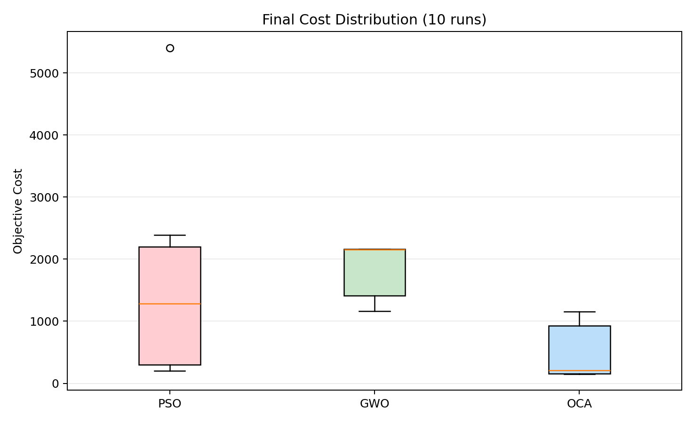
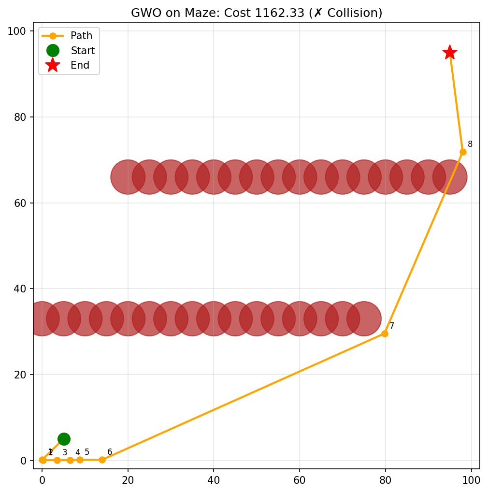
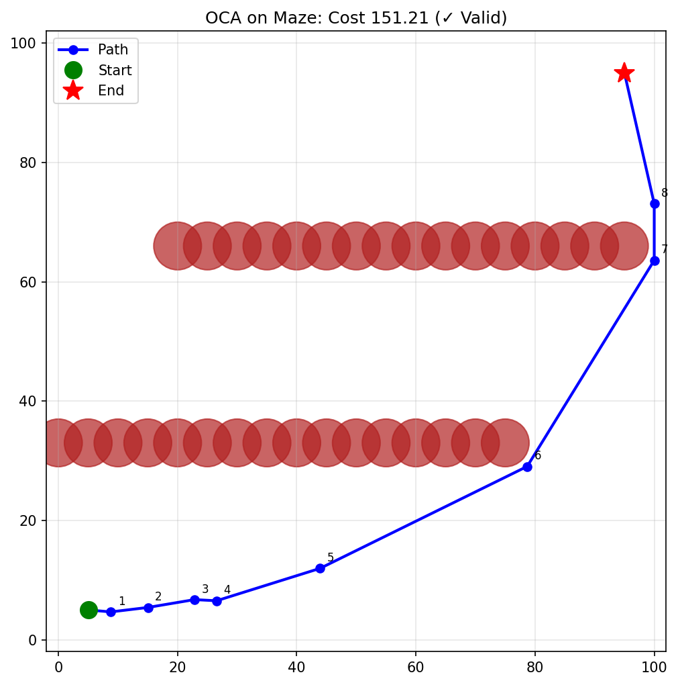

# Lab Project Report: Hybrid OCA for Constrained Robot Path Planning

Author: Vishnu V  
Course: Meta Heuristic Optimization Techniques (19MAM83)  
Date: April 2026

## Abstract

This lab project investigates autonomous robot path planning in a constrained 2D maze using a hybrid meta-heuristic optimization approach. The proposed method, Overclocking Algorithm (OCA), combines Grey Wolf Optimizer (GWO)-style multi-leader exploration with Particle Swarm Optimization (PSO)-style momentum-based exploitation. The objective is to minimize path length while avoiding collisions with circular obstacles using a heavy collision penalty. Experiments were conducted with identical optimization budgets for PSO, GWO, and OCA on the same scenario. The proposed OCA achieved the best overall performance with mean cost 476.985, best cost 151.212, and 70% valid-path rate, outperforming PSO and GWO by 70.08% and 74.37% in mean objective cost, respectively. Statistical tests (one-sided Wilcoxon signed-rank) show significant gains of OCA over both baselines (p < 0.01).

## Introduction to the problem

Autonomous navigation in constrained environments is a core robotics problem. A robot must move from a start position to a goal position while:

1. Avoiding obstacles.
2. Keeping the route short.
3. Producing feasible and smooth trajectories.

In this project, the environment is a maze-like 2D map with 32 circular obstacles. The robot path is encoded by 8 intermediate waypoints (16 continuous decision variables). The optimization objective is:

$$
f(x) = L(x) + \lambda \cdot C(x)
$$

where:

$$
L(x) = \sum_{i=0}^{k} ||p_{i+1} - p_i||_2, \quad \lambda = 1000
$$

and $C(x)$ is the number of colliding path segments. This problem is challenging because the cost landscape is non-convex, highly discontinuous near obstacles, and contains many local minima.

## Description about the existing work

Existing path planning work can be grouped into three broad categories:

1. Classical deterministic methods (A*, D*, Theta*, RRT variants): strong in structured environments but can suffer in dynamic or high-dimensional settings.
2. Bio-inspired standalone methods (PSO, GWO, ACO, GA, FA): robust global search but sensitive to parameter settings and prone to instability or premature convergence in hard maps.
3. Hybrid methods (for example NCM-GWO, ABGPSO, PFACO): combine complementary strengths, generally yielding better robustness and quality.

For this lab assignment, the direct existing baselines are:

1. PSO: velocity-based swarm search with inertia, cognitive, and social terms.
2. GWO: alpha-beta-delta leader guidance with exploration factor decay.

Observed baseline limitations in the maze scenario:

1. PSO can occasionally discover good feasible routes, but high variance and unstable runs occur.
2. GWO is more stable in spread than PSO but often remains in high-cost infeasible basins under this penalty setup.

## Theoretical comparison between existing and proposed methodology

| Aspect | Existing PSO | Existing GWO | Proposed OCA (Hybrid) |
| --- | --- | --- | --- |
| Search Driver | Velocity + pbest/gbest | Alpha-beta-delta leader encircling | Multi-leader guidance + momentum |
| Exploration Control | Inertia decay | Linear a-decay | Voltage schedule (DVFS), optional aggressive scaling |
| Exploitation | Strong when gbest is good | Moderate via leader averaging | Strong local refinement through momentum |
| Stagnation Handling | Limited | Limited | Cache-miss reset of stagnant particles |
| Leader Strategy | Single global best | Top 3 leaders | Top p leaders (configured as 5 in best run) |
| Expected Behavior in Maze-like Penalty Landscape | Sensitive, oscillatory | Can plateau in infeasible regions | Better exploration-exploitation balance and escape |

Why the proposed method is theoretically stronger:

1. It retains multi-leader directional diversity (from GWO behavior).
2. It introduces momentum propagation (PSO-like pipelining) for faster local descent.
3. It adds explicit anti-stagnation resets, improving local-optima escape.

## Proposed methodology

The proposed method is OCA, an embedded hybrid meta-heuristic that integrates leader-guided and velocity-guided updates in each iteration.

Core mechanisms:

1. P-core leaders: top-performing particles guide population movement.
2. DVFS voltage schedule: exploration amplitude decays from initial to final voltage across iterations.
3. Tri/multi-leader target synthesis: candidate target position is averaged from leader-influenced steps.
4. Momentum update: particle velocity carries useful directional history.
5. Cache-miss reset: stagnant particles are reinitialized near leaders with controlled noise.

High-level update idea:

1. Evaluate all particles and select leaders.
2. Compute voltage at current iteration.
3. For each particle, generate leader-influenced target.
4. Update velocity and position with clipping to bounds.
5. Reset if stagnation threshold is exceeded.

## Implementation details

Implementation used Python with NumPy and Matplotlib, with benchmark orchestration in:

1. research/examples/assignment_hybrid_oca_benchmark.py
2. research/examples/baselines.py
3. research/src/oca/algorithm.py
4. research/examples/pathfinding_benchmark.py

Experiment setup used in final benchmark:

1. Scenario: Maze.
2. Number of waypoints: 8.
3. Decision dimension: 16.
4. Population size: 40.
5. Tuning phase: 120 iterations, 5 runs.
6. Final phase: 200 iterations, 10 runs.
7. Seed schedule: 0 to 9 for final runs.

Selected final parameters from tuning:

1. PSO: {w: 0.8, c1: 1.8, c2: 1.8}
2. GWO: default baseline configuration.
3. OCA: {num_p_cores: 5, initial_voltage: 2.0, final_voltage: 0.0, aggressive_voltage: True}

Evaluation metrics:

1. Mean objective cost.
2. Best and worst objective cost.
3. Standard deviation of cost.
4. Mean runtime per run.
5. Valid-path rate (collision-free ratio).
6. Wilcoxon signed-rank significance against baselines.

## Comparative study between existing work and the proposed work with supporting evaluation metrics

### Final 10-run performance summary

| Algorithm | Mean Cost | Best Cost | Worst Cost | Std Cost | Mean Time (s) | Valid Rate |
| --- | ---: | ---: | ---: | ---: | ---: | ---: |
| PSO | 1594.282 | 202.203 | 5402.203 | 1596.203 | 6.817 | 30% |
| GWO | 1860.850 | 1162.334 | 2163.518 | 480.565 | 9.977 | 0% |
| OCA (Proposed) | 476.985 | 151.212 | 1157.828 | 470.721 | 8.037 | 70% |

### Relative improvement of proposed method

1. OCA vs PSO mean-cost improvement:

$$
\frac{1594.282 - 476.985}{1594.282} \times 100 = 70.08\%
$$

2. OCA vs GWO mean-cost improvement:

$$
\frac{1860.850 - 476.985}{1860.850} \times 100 = 74.37\%
$$

### Statistical significance

| Comparison | Test | Statistic | p-value | Median Gain % |
| --- | --- | ---: | ---: | ---: |
| OCA vs PSO | Wilcoxon signed-rank (one-sided, OCA < baseline) | 4.0 | 0.0068359 | 83.55 |
| OCA vs GWO | Wilcoxon signed-rank (one-sided, OCA < baseline) | 0.0 | 0.0009766 | 90.21 |

Interpretation:

1. Both p-values are below 0.01.
2. The proposed OCA is statistically better than both existing baseline methods on this benchmark instance.

### Discussion of results

1. OCA yields the best quality and feasibility balance.
2. PSO is faster than OCA on average but much less reliable.
3. GWO is slower than OCA and produced no valid paths in this setup.
4. The hybrid design improves robustness by combining leader diversity, momentum refinement, and stagnation reset.

## Conclusion with possible future enhancements suggestions

This lab project demonstrates that the proposed OCA hybrid methodology outperforms the selected existing standalone methods (PSO and GWO) for constrained robot path planning in a maze environment. Under fair and equal computational budgets, OCA achieved substantially lower objective cost and significantly higher feasible-path discovery rate.

Possible future enhancements:

1. Multi-scenario evaluation (Trap, Clutter, Forest, Corridor) for broader generalization.
2. Multi-objective formulation adding smoothness, curvature, and energy terms.
3. Adaptive penalty strategy instead of fixed collision penalty.
4. Dynamic obstacle handling with replanning under moving constraints.
5. GPU/parallel acceleration for near real-time deployment.
6. Post-processing path smoothing with curvature-constrained splines.

## Appendix containing source code and screenshots of output

### Appendix A: Source code excerpts

#### A1. OCA class constructor and control parameters (excerpt)

```python
class OverclockingAlgorithm:
    def __init__(
        self,
        pop_size: int = 30,
        aggressive_voltage: bool = False,
        num_p_cores: int = 3,
        initial_voltage: float = 2.0,
        final_voltage: float = 0.0,
    ):
        if num_p_cores < 1:
            raise ValueError("num_p_cores must be at least 1")
        if num_p_cores >= pop_size:
            raise ValueError("num_p_cores must be less than pop_size")
```

#### A2. Benchmark configuration (excerpt)

```python
@dataclass
class ExperimentConfig:
    scenario: str = "Maze"
    n_waypoints: int = 8
    pop_size: int = 40
    tune_iterations: int = 120
    final_iterations: int = 200
    tune_runs: int = 5
    final_runs: int = 10
```

#### A3. Path objective and collision penalty concept (excerpt)

```python
def evaluate(self, x):
    path = self.decode(x)
    total_dist = 0
    penalty = 0
    for i in range(len(path) - 1):
        p1 = path[i]
        p2 = path[i+1]
        dist = np.linalg.norm(p2 - p1)
        total_dist += dist
        for obs in self.obstacles:
            if self._segment_intersects_circle(p1, p2, (obs[0], obs[1], obs[2] + 1)):
                penalty += 1000
    return total_dist + penalty
```

### Appendix B: Screenshots of output

#### B1. Hybrid process flowchart


#### B2. Convergence comparison


#### B3. Final-cost distribution



#### B4. Best path found by PSO


#### B5. Best path found by GWO



#### B6. Best path found by OCA


