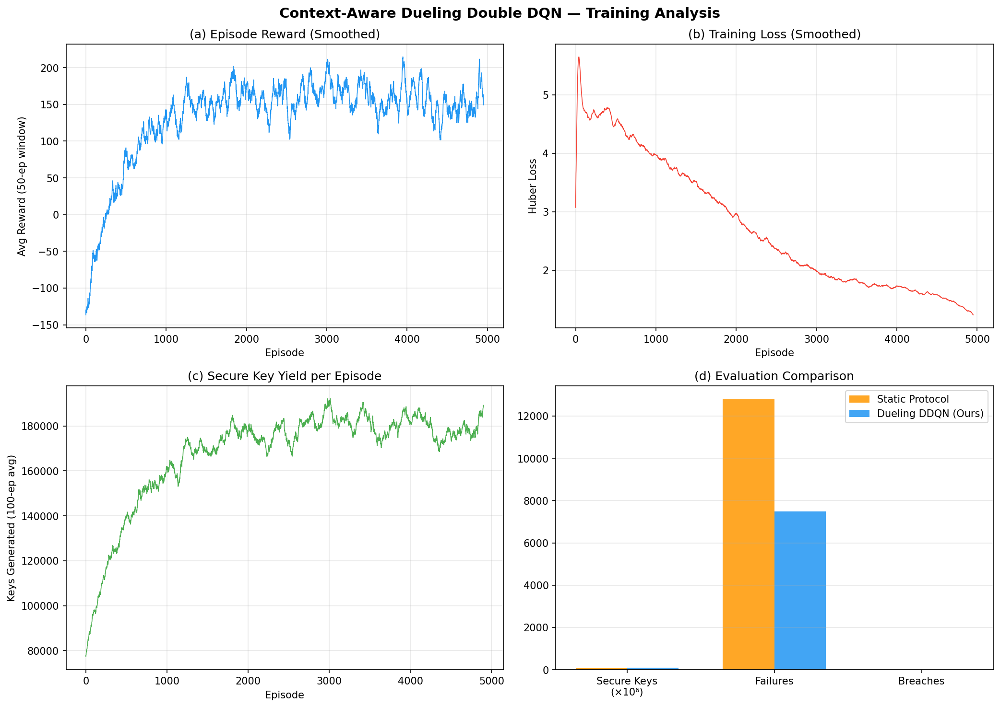

# Abstract

Quantum Key Distribution (QKD) systems are theoretically secure, but practical deployments face dynamic channel conditions such as turbulence, noise, and intermittent eavesdropping behavior. Static parameter settings in classical BB84 post-processing often cause either capacity under-utilization in good channel conditions or security/failure events in adverse conditions. This project proposes a context-aware Deep Reinforcement Learning (DRL) controller to adapt Privacy Amplification (PA) ratio and Authentication Tag length in real time.

The implemented solution uses a trained Dueling Double DQN policy for action selection over a 40-action space (4 tag lengths x 10 PA levels), with decisions constrained by Devetak-Winter secure capacity logic in simulation and evaluation. Compared with static policy behavior, the project demonstrates stronger convergence behavior, improved secure key yield, and fewer failed/aborted blocks. The paper-associated analysis reports up to 79.66% improvement in secure key generation and 55.89% reduction in failed/aborted blocks for the context-aware model.

# Problem Statement

In practical BB84-based QKD links, channel quality can change rapidly due to environmental effects and adversarial conditions. A fixed post-processing policy is not robust enough for these fluctuations.

The core problem addressed is:

- How to dynamically tune PA ratio and authentication overhead so that secure key throughput is maximized.
- How to avoid security violations when channel conditions degrade.
- How to prevent excessive block failures and key-pool depletion under unstable channel conditions.

Limitations of static and naive approaches:

- Static protocol (for example, fixed Tag=64, PA=0.5) cannot adapt to rising QBER trends.
- Reactive-only RL without context (no trend or momentum awareness) can make unstable decisions in noisy environments.
- Without stabilization strategies, Q-learning can suffer from moving-target instability and weak convergence.

# Methodology and Algorithms Used

## 1. System Design Overview

The implementation uses an integrated simulation + inference setup:

- QKD simulator and monitoring dashboard in [research/qkd-dashboard.html](research/qkd-dashboard.html).
- Trained model inference backend in [research/qkd_backend.py](research/qkd_backend.py).
- Model checkpoint loading from [research/outputs/models](research/outputs/models).

The backend exposes:

- `GET /health` for model status and metadata.
- `POST /predict` for policy inference from state vector input.

## 2. State, Action, and Reward Modeling

### State Representation

The context-aware policy uses a multi-feature state that includes present channel quality and trend indicators. In the dashboard logic, state construction includes QBER, Delta-QBER, average-QBER context, SNR proxy, key-pool level, and turbulence/eavesdrop indicators. The trained model backend consumes the checkpoint-defined state dimension (default configured as 7).

### Action Space

Action space has 40 discrete actions:

- Tag length in {32, 64, 96, 128}
- PA ratio in {0.1, 0.2, ..., 1.0}

Mapping used in implementation:

- `tag_idx = action // 10`
- `pa_idx = action % 10`

### Security Capacity and Reward Basis

The project follows entropy-based secure capacity modeling with Devetak-Winter style bounds:

$$
h_2(p) = -p \log_2(p) - (1-p)\log_2(1-p)
$$

$$
r_{secure}(QBER) = \max\left(0, 1 - h_2(QBER) - 1.16\,h_2(QBER)\right)
$$

Actions with PA above secure capacity are treated as insecure and penalized in the environment logic.

## 3. Algorithms Used

The dashboard and paper comparison include the following policies:

1. Static Protocol (Baseline)
- Fixed action strategy (Tag=64, PA=0.5)
- Serves as deterministic baseline.

2. Random Policy
- Uniform random selection from 40 actions.
- Used as sanity baseline.

3. Naive DQN (No Stabilization)
- Reactive to instantaneous conditions but weak under rapid channel transitions.
- No robust context trend handling.

4. Context-Aware DQN (Heuristic Approximation)
- Rule-based approximation that uses trend behavior (Delta-QBER) for pre-emptive throttling.
- Provides fallback behavior when backend is offline.

5. Context-Aware Dueling Double DQN (Trained Model)
- Neural policy inference through backend endpoint.
- Dueling architecture implemented in PyTorch backend with separate value and advantage streams.
- Uses model checkpoint weights from the project outputs directory.

# Implementation Screenshot and Results

## Available Project Screenshot



## Result Summary

Observed from the available training analysis and project artifacts:

- Episode reward shows clear learning progression from low initial values to a substantially higher stable regime.
- Smoothed training loss (Huber loss) trends downward, indicating improved value estimation stability.
- Secure key yield trend increases over episodes and stabilizes at a higher operating region.
- Comparative evaluation indicates the context-aware DRL policy produces better secure throughput than static baseline while reducing failures.

Paper-referenced outcomes for the proposed context-aware approach:

- Secure key generation improvement: 79.66%
- Failed/aborted block reduction: 55.89%
- Reported failure profile shift: from high static failure levels (greater than 20%) toward low failure rates (about 8%)

## Notes on Implementation Assets

- Interactive implementation interface: [research/qkd-dashboard.html](research/qkd-dashboard.html)
- Inference backend service: [research/qkd_backend.py](research/qkd_backend.py)
- Trained checkpoint directory: [research/outputs/models](research/outputs/models)
- Paper source used for report context: [research/RL Papers/MY PAPER/FINAL Adaptive Quantum Cryptographic Protocol.pdf](research/RL%20Papers/MY%20PAPER/FINAL%20Adaptive%20Quantum%20Cryptographic%20Protocol.pdf)

# Conclusion

This project demonstrates that context-aware DRL can make QKD post-processing more robust than static protocols under dynamic channel conditions. By combining secure-capacity-aware decision logic, adaptive parameter control, and stabilized deep RL policy behavior, the system improves secure key yield while reducing operational failures. The current implementation and artifacts support the practical viability of adaptive, learning-driven quantum communication control.

# Pandoc Conversion

To convert this Markdown report to a Word document:

```bash
pandoc research/QKD_Project_Report.md -o research/QKD_Project_Report.docx
```
